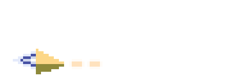
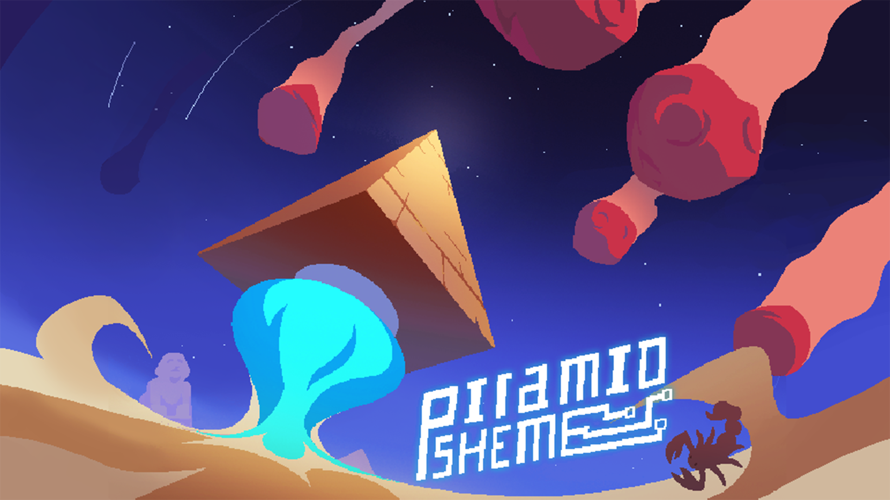
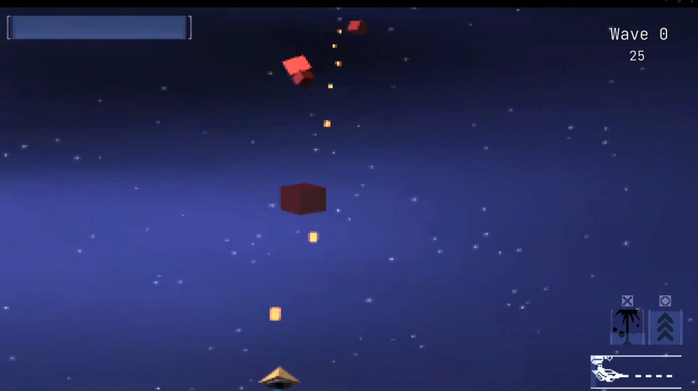
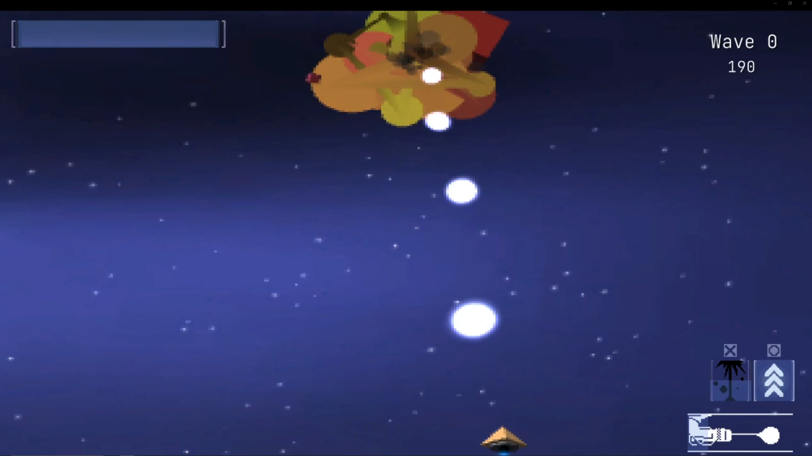
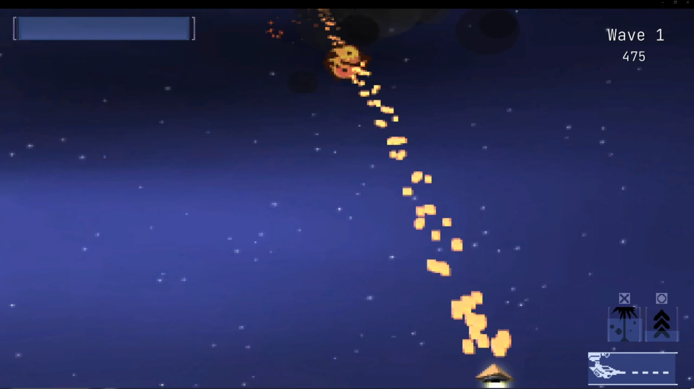
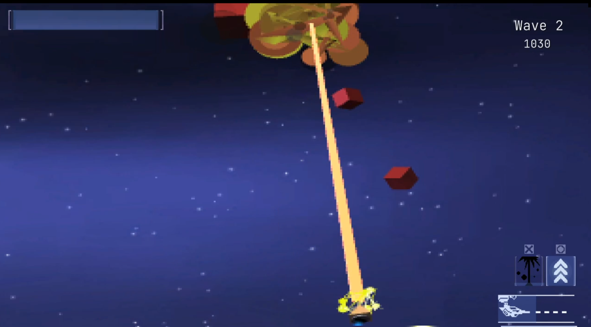

# Pyramid Scheme

  

  

Pyramid Scheme is a fun take on the classic arcade asteroid-destroyer games. 

In Pyramid Scheme the user takes control of a small, yellow, pyramid-like ship, using whatever  
weapons of mass destruction available, to prevent asteroids from entering Earth's atmosphere below.  
The ship is equipped with rail guns, plasma cannons, and a huge laser, just as an extra precaution. 

This game works with controller and has built-in gyro control functionality.

Made in the Unity game engine.  
Submitted as an assignment project at Bournemouth University (2022). 

You can try Pyramid Scheme out for yourself on itch.io [here](https://cyanryan50.itch.io/pyramid-scheme), or download the .zip [here](https://drive.google.com/file/d/1HD3fAW-OjbiJprLJ774V5Q_TbUlqjiaj/view?usp=sharing).  

# Current Video Demonstration
[Pyramid Scheme - Video Demo](https://youtu.be/W25J8B5bF3U)  
[Pyramid Scheme - Assignment Submission Breakdown Video](https://youtu.be/FkA-EZ2qEL0)  
